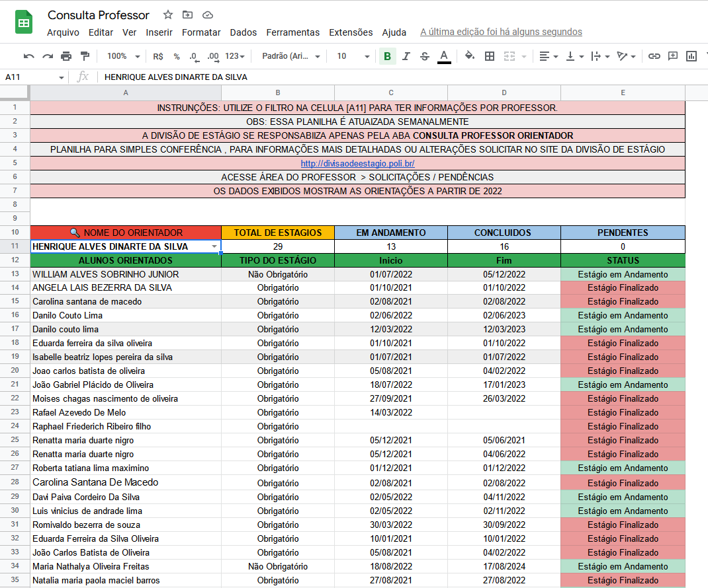

# 👨‍🏫🏫👩‍🏫 Acompanhamento de Orientações

## 🎯 Proposta
Sistema para os professores monitorarem suas orientações de estágio

> Sistema exibindo as orientações do professor Henrique Alves Dinarte.

## 🚀 Funcionalidades

- [x] Func 1
- [x] Func 2
- [x] Func 3

## :man_technologist: Contribuidores
<table>
  <tr>
    <td align="center">
      <a href="https://github.com/LucasHenrique-dev">
         
        
          <b>Lucas Henrique</b>
        
      </a>
    </td>
  </tr>
</table>

[⬆ Voltar ao topo](#-acompanhamento-de-orientações)
