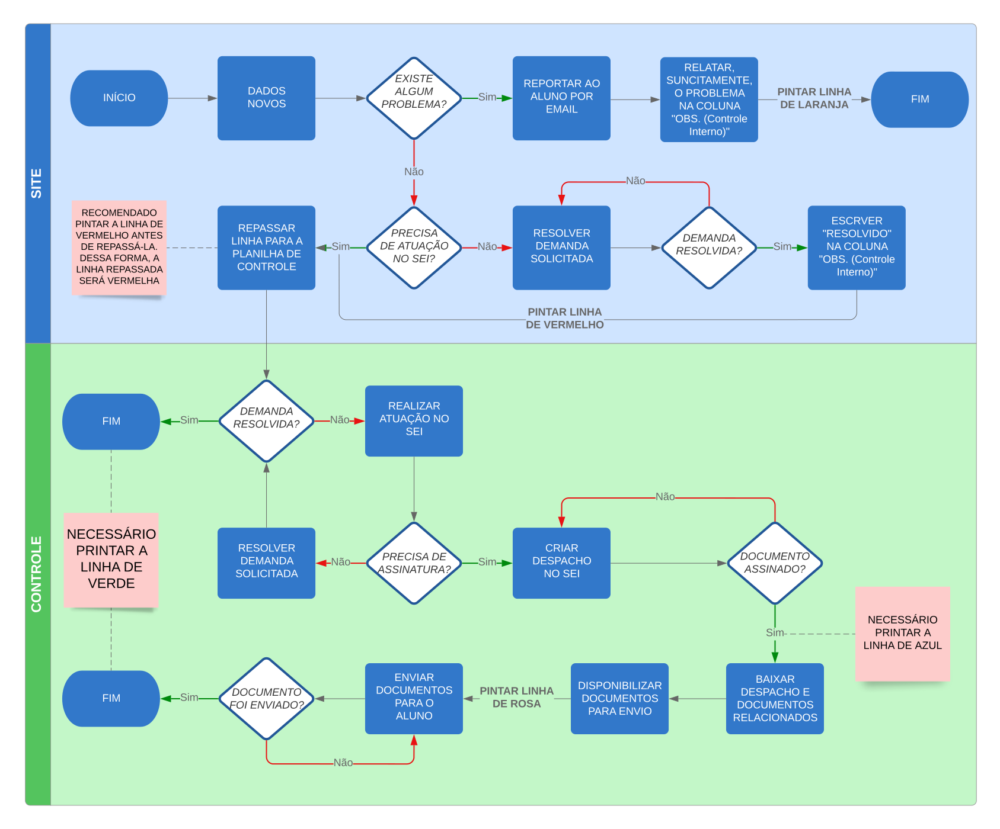

# 📃 Solicitações e Pendências
O seguinte documento descreve os procedimentos os quais todo estagiário na divisão de estágio da Poli deve tomar para tartar qualquer solicitação ou pendência enviada por usuários que preencheram o formulário oficial e que possuam registro na planilha.

## ℹ️ Tópicos
- [O que é uma Solicitação](#solicitações)
- [O que é uma Pendência](#pendências)
- [Formulário de Resposta](#formulário)
- [Manual das Cores](#manual-das-cores)
    - [Legenda Detalhada](#legenda-de-cores)
    - [Legenda Simplificada](#legenda-de-cores-simplificada)
    - [Fluxo Funcional](#fluxo-funcional-das-cores)
- [Planilhas](#planilha)
    - [Descrição](#descrição-das-planilhas)
    - [Detalhamento das Colunas](#detalhamento-das-colunas)
        - [Colunas Padrão](#colunas-de-respostas-do-formulário)
        - [SITE](#solicitações-e-pendências---site)
        - [CONTROLE](#solicitações-e-pendências---controle)
- [Rotina de Trabalho](#rotina)
- [Tratamento das Demandas](#tratamento-das-demandas)
    - [Termo Aditivo de Estágio](#termo-aditivo-de-estágio)
        - [Renovação de Estágio](#renovação-de-estágio)
        - [Mudança de Estágio](#mudança-de-estágio)

---
### SOLICITAÇÕES
> Do latim *sollicitūdo*, solicitação é uma diligência cuidadosa, um requerimento ou um pedido. O verbo solicitar, por sua vez, refere-se ao acto de pedir, exigir, pretender ou procurar algo.

Para fins práticos, considera-se uma solicitação todo pedido ou exigência feita à Divisão de estágio. Dessa forma, ela pode ser feita por alunos, professores ou empresas.
A exemplo de solicitações, tem-se:
- Solicitação de Alteração de Tipo de Estágio:
    - Ator: Aluno
    - Descrição: Aluno envia documento objetivando mudar a modalidade de seu estágio, seja de não obrigatório para obrigatório ou vice e versa
- Entrega de Termo Aditivo:
    - Ator: Aluno
    - Descrição: Aluno envia documento objetivando mudar alguma cláusula de seu contrato de estágio, seja ela o tempo de vigência no estágio, carga horária de trabalho, benefícios e afins

---
### PENDÊNCIAS
> Algo que ainda não foi resolvido ou solucionado; Que não foi finalizado, está pendente.

Para fins práticos, considera-se uma pendência todo tipo de documentação faltante em relação a um sujeito ou entidade. Em outras palavras, são documentos que devem estar em posse da Divisão de Estágio e que por algum motivo não foram entregues ou possuem um prazo de entrega. Portanto, é essencial que tais documentos sejam cobrados e devidamente coletados e registrados.
A exemplo de pendências, tem-se:
- Entrega de Termo de Professor Orientador:
    - Ator: Aluno
    - Descrição: Aluno envia documento objetivando resolver pendência sobre a escolha de seu professor orientador
- Entrega de Plano de Atividades de Estágio:
    - Ator: Aluno
    - Descrição: Aluno envia documento objetivando resolver pendência sobre a entrega de seu plano de atividades de estágio

---
### FORMULÁRIO
O formulário oficial de trabalho da Divisão de Estágio Poli para casos de solicitações e pendências, chama-se "Solicitações e Pendências". Nele, toda e qualquer pessoa/entidade que o preencher irá se identificar, preencher suas informações de contato, sinalizar sua necessidade e pedir e/ou enviar documentos.
De maneira mais detalhada, o fluxo de informações segue o seguinte padrão:
1. Identifiação:

    1. Usuário informa seu email de contato **(OBRIGATÓRIO)**
    1. Usuário informa se é "Aluno", "Professor" ou "Empresa" **(OBRIGATÓRIO)**
1. Informações Específicas:
    
    Nesta etapa, o usuário preenche um série de campos para que, assim, possa ser melhor identificado. Tais informações preenchidas dependem de quem está utilizando o formulário.
    1. Aluno:
        1. Aluno informa seu curso **(OBRIGATÓRIO)**
        1. Aluno informa seu nome **(OBRIGATÓRIO)**
        1. Aluno informa seu CPF **(OBRIGATÓRIO)**
        1. Aluno informa seu período atual **(OBRIGATÓRIO)**
        1. Aluno informa seu telefone para contato (OPCIONAL)
    1. Professor:
        1. Professor informa seu nome **(OBRIGATÓRIO)**
        1. Professor informa seu curso de pleno **(OBRIGATÓRIO)**
        1. Professor informa seu número de matrícula **(OBRIGATÓRIO)**
    1. Empresa:
        1. Empresa informa seu nome **(OBRIGATÓRIO)**
        1. Empresa informa seu CNPJ **(OBRIGATÓRIO)**
        1. Empresa informa o nome do seu representante **(OBRIGATÓRIO)**
1. Sinalização de Necessidade:

    1. Usuário informa o tipo de necessidade, o qual pode ser: **(OBRIGATÓRIO)**
        - Solicitação
        - Pendência
        - Entrega de Relatório Final
1. Detalhamento da Necessidade:

    Nesta etapa, o usuário seleciona o tipo específico de sua necessidade. Caso a opção escolhida na etapa enterior tenha sido "Entrega de Relatório Final", a próxima etapa do fluxo é "Informações do Relatório" e, portanto, etapa atual não é considerada para este caso.
    1. Usuário informa uma categoria específica sobre sua necessidade **(OBRIGATÓRIO)**
1. Descrição da Necessidade:

    1. Usuário informa descrição detalhada sobre sua necessidade (OPCIONAL)
1. Envio de Arquivos:

    1. Usuário envia arquivos referentes a sua necessidade (OPCIONAL)
1. Informações do Relatório:

    1. Usuário informa o tipo de relatório o qual pretende entregar **(OBRIGATÓRIO)**
    1. Usuário anexa o arquivo PDF referente ao relatório de estágio **(OBRIGATÓRIO)**
    1. Usuário informa algum comentário pertinente à situação (OPCIONAL)      

---
### MANUAL DAS CORES
A seguinte sessão visa mostrar o funcionamento do sistema de cores usadas para trabalhar os dados das planilhas de Solicitações e Pendências.

#### LEGENDA DE CORES
1. Solicitações e Pendências - SITE
    1. <mark style="background-color:white">BRANCO</mark>: Novos Dados/novas respostas vindas do formulário -> Informações ainda não tratadas
    1. <mark style="background-color:orange">LARANJA</mark>: Existe algum problema e já foi reprotado para o solicitante
    1. <mark style="background-color:red">VERMELHO</mark>: Dados checados e procedentes. Solicitação/Pendência já foi repassada para a planilha "Solicitações e Pendências - CONTROLE"
1. Solicitações e Pendências - CONTROLE
    1. <mark style="background-color:red">VERMELHO</mark>: Requisitos checados. Precissa de atuação no SEI ou exige resolução para um problema específico
    1. <mark style="background-color:blue">AZUL</mark>: Atuação no SEI realizada. Falta coordenador assinar
    1. <mark style="background-color:yellow">AMARELO</mark>: Documento assinado pelo coordenador
    1. <mark style="background-color:pink">ROSA</mark>: Documento assinado disponível na pasta compartilhada. Falta enviar para o interessado por email
    1. <mark style="background-color:green">VERDE</mark>: Email enviado e Solicitação/Pendência resolvida

#### LEGENDA DE CORES SIMPLIFICADA
1. Solicitações e Pendências - SITE  
    &emsp;  
  
    &emsp;  
  
    &emsp;  

1. Solicitações e Pendências - CONTROLE  
    &emsp;  
  
    &emsp;  
  
    &emsp;  
  
    &emsp;  
  
    &emsp;  
  

<!-- Site para inserir place holders: https://placehold.co/ -->

#### FLUXO FUNCIONAL DAS CORES

---
### PLANILHA
O trabalho dos estagiários, servidores e coordenador da Divisão de Estágio para a resolução das demandas de solicitações e pendências se baseia na gestão de dados em planilhas. A fim de organizar melhor o trabalho sobre os dados, está estabelecido que:

#### DESCRIÇÃO DAS PLANILHAS
- Planilha com identificador "SITE":
    - FUNÇÃO: Serve para realizar os primeiros tratamentos sobre os dados que chegam do formulário "Solicitações e Pendências", descrito em [Formulário](#formulário)
    - RESPONSÁVEIS: estagiários
- Planilha com identificador "CONTROLE":
    - FUNÇÃO: Continuação do tratamento dos dados realizados na planilha SITE. Nesta etapa, os dados podem ou não necessitar de atuação no SEI ([Sistema Eletrônico de Informações](https://sei.pe.gov.br/sip/login.php?sigla_orgao_sistema=GOVPE&sigla_sistema=SEI))
    - RESPONSÁVEIS: estagiários, servidores e coordenador da divisão de estágio

#### DETALHAMENTO DAS COLUNAS

##### COLUNAS DE RESPOSTAS DO FORMULÁRIO:
1. Carimbo de data/hora
    - DESCRIÇÃO: coluna padrão de registro de repostas vindas dos formulários Google
    - FORMULÁRIO: -
    - INFORMAÇÃO: exibe o Dia, Mês, Ano, Hora, Minutos e Segundos em que a resposta foi registrada. Segue o padrão: DD/MM/AA HH:MM:SS
    - FÓRMULA: -
1. Endereço de e-mail
    - DESCRIÇÃO: registra o email de contato
    - FORMULÁRIO: corresponde ao campo "E-mail"
    - INFORMAÇÃO: exibe o email. Segue o padrão: nome@domínio
    - FÓRMULA: -
1. Identifique-se
    - DESCRIÇÃO: registra o tipo do solicitante
    - FORMULÁRIO: corresponde ao campo "Identifique-se"
    - INFORMAÇÃO: exibe o tipo do solicitante. As opções possíveis são: **Aluno**, **Professor**, **Empresa**
    - FÓRMULA: -
1. Curso
    - DESCRIÇÃO: registra o curso do **ALUNO**
    - FORMULÁRIO: corresponde ao campo "Curso"
    - INFORMAÇÃO: exibe o curso do **ALUNO**. As opções possíveis são: Engenharia Civil, Engenharia Elétrica Eletrotécnica, Engenharia Mecânica Industrial, Engenharia Elétrica Eletrônica, Engenharia Elétrica de Telecomunicações, Engenharia da Computação, Engenharia Controle e Automação, Física dos Materiais
    - FÓRMULA: -
1. Nome do Aluno
    - DESCRIÇÃO: registra o nome do **ALUNO**
    - FORMULÁRIO: corresponde ao campo "Nome do Aluno"
    - INFORMAÇÃO: exibe o nome do **ALUNO**
    - FÓRMULA: -
1. CPF
    - DESCRIÇÃO: registra o CPF do **ALUNO**
    - FORMULÁRIO: corresponde ao campo "CPF"
    - INFORMAÇÃO: exibe o CPF do **ALUNO**. Resposta possue apenas números
    - FÓRMULA: -
1. Período Atual
    - DESCRIÇÃO: registra a quantidade de períodos cursados pelo **ALUNO** na UPE, incluindo o período atual
    - FORMULÁRIO: corresponde ao campo "Período Atual"
    - INFORMAÇÃO: exibe a quantidade de períodos cursados. Resposta possue apenas números
    - FÓRMULA: -
1. Telefone
    - DESCRIÇÃO: registra o telefone do **ALUNO**
    - FORMULÁRIO: corresponde ao campo "Telefone"
    - INFORMAÇÃO: exibe o telefone do **ALUNO**. Resposta possue apenas números, segue o padrão: DDD + número de telefone
    - FÓRMULA: -
1. Nome do Professor
    - DESCRIÇÃO: registra o tipo do solicitante
    - FORMULÁRIO: corresponde ao campo "E-mail"
    - INFORMAÇÃO: exibe o email. Segue o padrão: nome@domínio
    - FÓRMULA: -
1. Pleno
    - DESCRIÇÃO: registra o tipo do solicitante
    - FORMULÁRIO: corresponde ao campo "E-mail"
    - INFORMAÇÃO: exibe o email. Segue o padrão: nome@domínio
    - FÓRMULA: -
1. Matrícula
    - DESCRIÇÃO: registra o tipo do solicitante
    - FORMULÁRIO: corresponde ao campo "E-mail"
    - INFORMAÇÃO: exibe o email. Segue o padrão: nome@domínio
    - FÓRMULA: -
1. Nome da Empresa
    - DESCRIÇÃO: registra o tipo do solicitante
    - FORMULÁRIO: corresponde ao campo "E-mail"
    - INFORMAÇÃO: exibe o email. Segue o padrão: nome@domínio
    - FÓRMULA: -
1. CNPJ
    - DESCRIÇÃO: registra o tipo do solicitante
    - FORMULÁRIO: corresponde ao campo "E-mail"
    - INFORMAÇÃO: exibe o email. Segue o padrão: nome@domínio
    - FÓRMULA: -
1. Representante
    - DESCRIÇÃO: registra o tipo do solicitante
    - FORMULÁRIO: corresponde ao campo "E-mail"
    - INFORMAÇÃO: exibe o email. Segue o padrão: nome@domínio
    - FÓRMULA: -
1. Qual a sua necessidade?
    - DESCRIÇÃO: registra o tipo do solicitante
    - FORMULÁRIO: corresponde ao campo "E-mail"
    - INFORMAÇÃO: exibe o email. Segue o padrão: nome@domínio
    - FÓRMULA: -
1. Qual seu tipo de solicitação?
    - DESCRIÇÃO: registra o tipo do solicitante
    - FORMULÁRIO: corresponde ao campo "E-mail"
    - INFORMAÇÃO: exibe o email. Segue o padrão: nome@domínio
    - FÓRMULA: -
1. Outros
    - DESCRIÇÃO: registra o tipo do solicitante
    - FORMULÁRIO: corresponde ao campo "E-mail"
    - INFORMAÇÃO: exibe o email. Segue o padrão: nome@domínio
    - FÓRMULA: -
1. Qual seu tipo de pendência?
    - DESCRIÇÃO: registra o tipo do solicitante
    - FORMULÁRIO: corresponde ao campo "E-mail"
    - INFORMAÇÃO: exibe o email. Segue o padrão: nome@domínio
    - FÓRMULA: -
1. Outros
    - DESCRIÇÃO: registra o tipo do solicitante
    - FORMULÁRIO: corresponde ao campo "E-mail"
    - INFORMAÇÃO: exibe o email. Segue o padrão: nome@domínio
    - FÓRMULA: -
1. Descreva aqui, em detalhes, o que você está precisando/irá mudar no seu contrato, em caso de entrega de termo aditivo
    - DESCRIÇÃO: registra o tipo do solicitante
    - FORMULÁRIO: corresponde ao campo "E-mail"
    - INFORMAÇÃO: exibe o email. Segue o padrão: nome@domínio
    - FÓRMULA: -
1. Solicitação/Pendência
    - DESCRIÇÃO: registra o tipo do solicitante
    - FORMULÁRIO: corresponde ao campo "E-mail"
    - INFORMAÇÃO: exibe o email. Segue o padrão: nome@domínio
    - FÓRMULA: -
1. Qual o tipo de seu relatório ?
    - DESCRIÇÃO: registra o tipo do solicitante
    - FORMULÁRIO: corresponde ao campo "E-mail"
    - INFORMAÇÃO: exibe o email. Segue o padrão: nome@domínio
    - FÓRMULA: -
1. Relatório de Estágio
    - DESCRIÇÃO: registra o tipo do solicitante
    - FORMULÁRIO: corresponde ao campo "E-mail"
    - INFORMAÇÃO: exibe o email. Segue o padrão: nome@domínio
    - FÓRMULA: -
1. Caso queira nos relatar algo, diga aqui abaixo:
    - DESCRIÇÃO: registra o tipo do solicitante
    - FORMULÁRIO: corresponde ao campo "E-mail"
    - INFORMAÇÃO: exibe o email. Segue o padrão: nome@domínio
    - FÓRMULA: -
##### SOLICITAÇÕES E PENDÊNCIAS - SITE:
As colunas listadas no tópico acima são as primeiras colunas desta planilha, ou seja, as primeiras 24 colunas de Solicitações e Pendências - SITE possuem as mesmas especificações das colunas já descritas anteriormente. Portanto, as especificações descritas abaixo dizem respeito à colunas próprias dessa planilha
1. OBS. (Controle Interno)
    - DESCRIÇÃO: registra o tipo do solicitante
    - FORMULÁRIO: corresponde ao campo "E-mail"
    - INFORMAÇÃO: exibe o email. Segue o padrão: nome@domínio
    - FÓRMULA: -
1. AUTOMAÇÕES ➡️➡️➡️
    - DESCRIÇÃO: registra o tipo do solicitante
    - FORMULÁRIO: corresponde ao campo "E-mail"
    - INFORMAÇÃO: exibe o email. Segue o padrão: nome@domínio
    - FÓRMULA: -
1. ARQUIVO 1
    - DESCRIÇÃO: registra o tipo do solicitante
    - FORMULÁRIO: corresponde ao campo "E-mail"
    - INFORMAÇÃO: exibe o email. Segue o padrão: nome@domínio
    - FÓRMULA: -
1. ARQUIVO 2
    - DESCRIÇÃO: registra o tipo do solicitante
    - FORMULÁRIO: corresponde ao campo "E-mail"
    - INFORMAÇÃO: exibe o email. Segue o padrão: nome@domínio
    - FÓRMULA: -
1. ARQUIVO 3
    - DESCRIÇÃO: registra o tipo do solicitante
    - FORMULÁRIO: corresponde ao campo "E-mail"
    - INFORMAÇÃO: exibe o email. Segue o padrão: nome@domínio
    - FÓRMULA: -
1. ARQUIVO 4
    - DESCRIÇÃO: registra o tipo do solicitante
    - FORMULÁRIO: corresponde ao campo "E-mail"
    - INFORMAÇÃO: exibe o email. Segue o padrão: nome@domínio
    - FÓRMULA: -
    
##### SOLICITAÇÕES E PENDÊNCIAS - CONTROLE:
1. Carimbo
1. Carimbo
1. Carimbo
1. Carimbo
1. Carimbo

---
### ROTINA
A seguinte sessão visa mostrar as primeiras ações a serem tomadas, por cada funcionário da Divisão de Estágio, para dar início ao tratamento das demandas relacionadas à Solicitações e Pendências.

**ESTAGIÁRIO**
- Fluxo Principal:
    1. Localizar computador de trabalho e logar em sua conta
        - **USUÁRIO**: as iniciais de seu nome, as mesmas usadas no e-mail institucional (@poli.br)
        - **SENHA**: seu CPF, **APENAS números**
    1. ATIVIDADE
- Fluxo Alternativo:
    1. COMPUTADOR INDISPONÍVEL
        1. Na etapa 1 do fluxo Principal, o computador estabelecido para trabalhar está indisponível para uso
        1. Procurar outro computador disponível para uso
        1. Pedir autorização do funcionário que normalmente usa este computador para trabalhar
        1. Continuar a etapa 1 do fluxo Principal
- Fluxo Exceção:
    1. ERRO AO LOGAR NO COMPUTADOR
        1. Na etapa 1 do fluxo Principal, ao logar, o computador retorna a "usuário inválido"
        1. Procurar suporte do DTI atarvés do sistema [Helpdesk](http://servicedesk.poli.br/portal)
        1. Usar as novas credenciais dadas pelo DTI
        1. Continuar a etapa 2 do fluxo Principal
    1. ATIVIDADE

**SERVIDOR**
- Fluxo Principal:
    1. ATIVIDADE
    1. ATIVIDADE
    1. ATIVIDADE
    1. ATIVIDADE
- Fluxo Alternativo:
    1. TÍTULO
        1. ATIVIDADE
        1. ATIVIDADE
        1. ATIVIDADE
- Fluxo Exceção:
    1. TÍTULO
        1. ATIVIDADE
        1. ATIVIDADE

**COORDENADOR**
- Fluxo Principal:
    1. ATIVIDADE
    1. ATIVIDADE
    1. ATIVIDADE
    1. ATIVIDADE
- Fluxo Alternativo:
    1. TÍTULO
        1. ATIVIDADE
        1. ATIVIDADE
        1. ATIVIDADE
- Fluxo Exceção:
    1. TÍTULO
        1. ATIVIDADE
        1. ATIVIDADE

### TRATAMENTO DAS DEMANDAS
A seguinte sessão visa mostrar o fluxo de trabalho dos funcionários da Divisão de Estágio sobre as demandas relacionadas à Solicitações e Pendências.

### DÚVIDA
- Ator: estagiário
- Pré-condição: solicitante envia dúvida por meio do formulário
- Pós-condição: -
- Fluxo Principal:
    1. Estagiário localiza a dúvida na planilha 'Solicitações e Pendencias - SITE', através da coluna 'Qual a sua necessidade?'
    1. Estagiário lê a descrição da dúvida, através da coluna 'Descreva aqui, em detalhes, o que você está precisando/irá mudar no seu contrato, em caso de entrega de termo aditivo'
    1. Estagiário localiza o emai do 
    1. Estagiário localiza a dúvida na planilha 'Solicitações e Pendencias - SITE'
- Fluxo Alternativo:
- Fluxo Exceção:

### RELATÓRIO FINAL
- Ator: aluno, estagiário, servidor, coordenador
- Pré-condição:
- Pós-condição:
- Fluxo Principal:
- Fluxo Alternativo:
- Fluxo Exceção:

### RECISÃO DE CONTRATO
- Ator: aluno, estagiário, servidor, coordenador
- Pré-condição:
- Pós-condição:
- Fluxo Principal:
- Fluxo Alternativo:
- Fluxo Exceção:

### ENTREGA DO ACORDO DE COOPERAÇÃO
- Ator: aluno, estagiário, servidor, coordenador
- Pré-condição:
- Pós-condição:
- Fluxo Principal:
- Fluxo Alternativo:
- Fluxo Exceção:

### TERMO DE REALIZAÇÃO DE ESTÁGIO
- Ator: aluno, estagiário, servidor, coordenador
- Pré-condição:
- Pós-condição:
- Fluxo Principal:
- Fluxo Alternativo:
- Fluxo Exceção:

### DECLARAÇÃO DE CONCLUSÃO DE ESTÁGIO
- Ator: aluno, estagiário, servidor, coordenador
- Pré-condição:
- Pós-condição:
- Fluxo Principal:
- Fluxo Alternativo:
- Fluxo Exceção:

### SOLICITAÇÃO DE DOCUMENTO MODELO
- Ator: aluno, estagiário, servidor, coordenador
- Pré-condição:
- Pós-condição:
- Fluxo Principal:
- Fluxo Alternativo:
- Fluxo Exceção:

### SOLICITAÇÃO DE APTIDÃO PARA ESTÁGIO
- Ator: aluno, estagiário, servidor, coordenador
- Pré-condição:
- Pós-condição:
- Fluxo Principal:
- Fluxo Alternativo:
- Fluxo Exceção:

### DEMANDAS EXTERNAS (ESCOLARIDADE)
- Ator: aluno, estagiário, servidor, coordenador
- Pré-condição:
- Pós-condição:
- Fluxo Principal:
- Fluxo Alternativo:
- Fluxo Exceção:

#### TERMO ADITIVO DE ESTÁGIO
##### PRORROGAÇÃO DO ESTÁGIO
- Ator: aluno, estagiário, servidor, coordenador
- Pré-condição: aluno envia o TAE pelo formulário
- Pós-condição: estágio segue em curso normalmente
- Fluxo Principal:
    1. Estagiário verifica na planilha ‘Solicitações e Pendências - Site’ os requisitos, deixa em vermelho caso esteja tudo ok e coloca na planilha ‘Solicitações e Pendências - Controle’
    1. Estagiário coloca o link do TAE na planilha ‘Cadastro de Estágios - Controle’
- Fluxo Alternativo: -
- Fluxo Exceção: -
##### TROCA DE MODALIDADE
- Ator: aluno, estagiário, servidor, coordenador
- Pré-condição:
- Pós-condição:
- Fluxo Principal:
- Fluxo Alternativo:
- Fluxo Exceção:

#### ALTERAÇÕES GERAIS (BOLSA, HORARIO DO ESTÁGIO, GESTOR...)
- Ator: aluno, estagiário, servidor, coordenador
- Pré-condição:
- Pós-condição:
- Fluxo Principal:
- Fluxo Alternativo:
- Fluxo Exceção:

### ENTREGA DE DOCUMENTOS PENDENTES
#### TERMO DE PROFESSOR ORIENTADOR
- Ator: aluno, estagiário, servidor, coordenador
- Pré-condição:
- Pós-condição:
- Fluxo Principal:
- Fluxo Alternativo:
- Fluxo Exceção:

#### PLANO DE ATIVIDADES DE ESTÁGIO
- Ator: aluno, estagiário, servidor, coordenador
- Pré-condição:
- Pós-condição:
- Fluxo Principal:
- Fluxo Alternativo:
- Fluxo Exceção:

#### TERMO DE COMPROMISSO
- Ator: aluno, estagiário, servidor, coordenador
- Pré-condição:
- Pós-condição:
- Fluxo Principal:
- Fluxo Alternativo:
- Fluxo Exceção:

#### CARTEIRA DE TRABALHO
- Ator: aluno, estagiário, servidor, coordenador
- Pré-condição:
- Pós-condição:
- Fluxo Principal:
- Fluxo Alternativo:
- Fluxo Exceção:

#### APÓLICE DE SEGURO DE ESTÁGIO
- Ator: aluno, estagiário, servidor, coordenador
- Pré-condição:
- Pós-condição:
- Fluxo Principal:
- Fluxo Alternativo:
- Fluxo Exceção:

[⬆ Voltar ao topo](#-solicitações-e-pendências)
